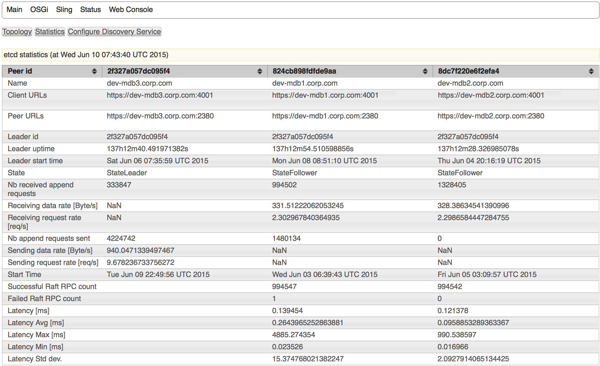
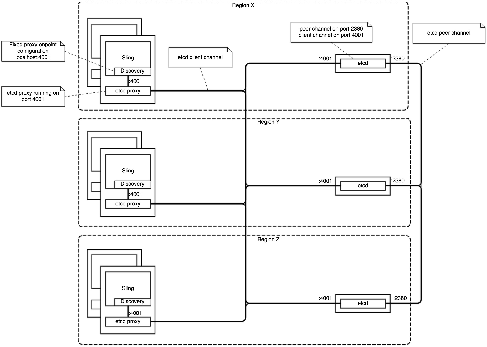

org.apache.sling.etcd.discovery
===============================

This module aims at providing an implementation of the Sling Discovery Service based on [CoreOS](https://coreos.com) [etcd](https://coreos.com/etcd). The module implements the [Sling Discovery API](https://github.com/apache/sling/tree/trunk/bundles/extensions/discovery/api/src/main/java/org/apache/sling/discovery) and can be used as an alternative implementation to the [default implementation](https://github.com/apache/sling/blob/trunk/bundles/extensions/discovery/impl/pom.xml).
This implementation has been proposed in the Apache Sling [dev](http://apache-sling.73963.n3.nabble.com/Sling-integration-with-Etcd-td4047017.html) list. It is one of the alternative implementations tracked in [SLING-2939](https://issues.apache.org/jira/browse/SLING-2939).

## Requirements

The module is aimed at being deployed in an OSGI container and is targetted for Apache Sling.
The implementation does not leverage the repository powering the Apache Sling instance. 
Instead it leverages etcd for persistence and for implementing leader election.
etcd itself implements the [Raft](https://raftconsensus.github.io/) consensus algorithm in order to allow this.

### etcd

etcd is an [open source](https://github.com/coreos/etcd) (Apache 2.0 license) piece of software written in Go. It is developed as part of the larger [CoreOS](https://coreos.com) project which is a specialized linux distribution. etcd must be deployed in order to use the module in Sling instances (etcd is not java thus can't and is not supposed to run on the Sling JVM).

However etcd can  be deployed without CoreOS. Binaries are readilly [available](https://github.com/coreos/etcd/releases) for some linux and OSX as well as a docker image.

etcd features a REST API which is the way the module uses to interract with it.
The etcd REST API version  [2.0](https://github.com/coreos/etcd/blob/release-2.0/Documentation/api.md) is currently supported by the module.

### etcd client

The [etcd client](../client/README.md) allows to communicate with the etcd REST API. It is required to be deployed along the current module in each Sling instance which wants to take part of the topology.


## Features

* Configurable announce and synchronization period
* Sling discovery events upon topology changes
* Configurable back-off for timers
* Handle duplicated announces (same Sling identifier)
* OSGI web console (etcd cluster statistics, Sling instance properties)
* Persists each instance properties in etcd
* Multi cluster views
* Automatic clustering (for Oak repository) or Configuration based clustering
* Client/server (Sling/etcd) [authentication](https://github.com/coreos/etcd/blob/v2.0.8/Documentation/security.md) based on certificates (allow dedicated keystore)
* Gzip encoding

The following is not yet supported

* Push mode using etcd watches (Need lease support in etcd v3.0)
* Proxy mode handling the etcd proxy logic in the Java etcd client (would allow deployments without the etcd proxy).

## Implementation

### Data structure

etcd is a hierarchical store which persists nodes (*Key* or *Folder*) at a given key structured as a path.
The table below lists the paths that are involved in the setup of a topology.
Each Key is prefixed with a &lt;rootKey&gt; which is configurable and allow isolated
topologies to be managed by the same etcd infrastructure.

| Key                                       | Description |
|:----------------------------------------- |:------------|
|&lt;rootKey&gt;/announces                  | *Folder* containing the announces from all instances in the topology. |
|&lt;rootKey&gt;/announces/&lt;uniqueId&gt; | <p>An announce *Key* holding the announce properties in json format. The format is of the form</p><pre>{"slingId": "&lt;slingId&gt;", "serverInfo":"&lt;serverInfo&gt;", "propertiesModifiedIndex":&lt;index&gt;, "clusterId": "&lt;clusterId&gt;"}</pre><p>where</p><ul><li>&lt;slingId&gt; is the Sling identifier of the instance associated to the announce.</li><li>&lt;serverInfo&gt; is the hostname and port allowing to reach the instance.</li><li>&lt;index&gt; is the a flag indicating (upon change) that the properties for associated have changed.</li><li>&lt;clusterId&gt; is the cluster identifier the instance associated to the announce belongs to.</li></ul><p>The &lt;uniqueId&gt; is generated by etcd when creating the *Key* (atomically and in order). The *Key* is set with a ttl (not permanent). The ttl must be refreshed (extended) or the announce automatically disappear.</p> |
|&lt;rootKey&gt;/properties                 | The properties *Folder* containing the properties for all instances in the topology. The properties *Folder* is permanent (no ttl). |
|&lt;rootKey&gt;/properties/&lt;slingId&gt; | An properties *Key* containing the properties for the instance identified by the  &lt;slingId&gt;, in json format. Properties keys are permanent (not ttl). |

### Operations

The module leverages mainly two features from etcd

* [Key TTL](https://github.com/coreos/etcd/blob/v2.0.10/Documentation/api.md#using-key-ttl) (Time To Live). Unless the ttl is extended, the key associated to the ttl is removed from etcd once the ttl has elapsed.
* [Atomic creation of ordered Keys](https://github.com/coreos/etcd/blob/v2.0.10/Documentation/api.md#atomically-creating-in-order-keys) which allows to create a global ordering among instances. This is used for determining the leaders (determined by the first key in the sequence).

#### Initial announce

Each instance must be announced to etcd in order to be part of the topology.
To this end, each instance tries to announce itself by creating an ordered key atomically.
The announce key contains the instance Sling identifier as well as the cluster identifier.

The instance considers itself as having joined the cluster only if it has created the first announce 
key among all the announces that contain the same Sling idenfier).
This allow to avoid two instances with the same Sling identifier to join a topology.

#### Refreshing announce

Announces keys are tied to a ttl. periodically, the instance 
refresh the announce key by extending the ttl period.
The announce period can be configured in order to delay the announces (extends the ttl) 
according to the amount of consecutive successfull refresh operations.

#### Fetching changes from remote instances

Periodically, each instance issue a request in order to fetch the list of announces from etcd.
Each announce contains the index of each other instance properties. 
In case of property change or if an instances has been added, the required properties are fetched 
and the topology view is updated.

#### Determining the leader instance

The leader instance is determined as the instance having created the first announce.

## Clustering

The instances can be grouped in clusters, represented in the Sling Discovery API by the `ClusterView` interface. The etcd implementation allows to group instances in two modes, Automatic or based on configurations. By default the Automatic mode is selected.
In both modes, etcd is not used for determining the cluster identifier.

### Automatic clustering

With this mode, etcd automatically group instances by their ability to communicate through the repository. Two instances that are connected to the same repository will be located in the same cluster in the topology. 

The automatic mode is implemented by doing an atomical store if not present operation in the repository it has access to on the resource `/etc/discovery/etcd`. The first instance to write the property in the repository defines the cluster identifier which remains stable accross restarts.

This mode is enabled by default, but works only with Oak based backends. The etcd service automatically switch to the Configuration mode if the backend does not support the automatic mode.

In order to allow a smooth transition from a setup that ran the ootb Sling discovery implementation to the etcd discovery, the Automatic clustering reuse the cluster identifier that may have been defined by the Sling discovery implementation. 

### Configuration based clustering

With this mode, the cluster identifier is specified by configuration (via an osgi config).
The clustering is more flexible but require configuration which is tedious and easy to get wrong.
The cluster idenfitier remains stable as long as the configuration does not change. 
Unless configured, the instances are put in the `default` cluster.


## Configuration

Most of the timeouts and periods can be configured in the `EtcdDiscoveryService` service OSGI configuration.


| Configuration | Property | Description | Default |
|:------------- |:---------|:------------|:--------|
|Root key       | rootKey  |The etcd root key used for implementing the discovery protocol, e.g. '/discovery' | /discovery|
|etcd endpoint  | endpoint |The endpoint uri to access the etcd peers (e.g. 'http://127.0.0.1:4001'). If the client is communicating with an etcd cluster, then the endpoint should reference a readwrite etcd proxy node. If the client is communicating with a single etcd node, the endpoint could reference it directly | http://localhost:4001|
|Socket Timeout | socketTimeout  | Defines the socket timeout (SO_TIMEOUT) in milliseconds, which is the timeout for waiting for data. A timeout value of zero is interpreted as an infinite timeout. A negative value is interpreted as undefined (system default). | 5000|
|Connection Timeout | connectionTimeout  |Determines the timeout in milliseconds until a connection is established. A timeout value of zero is interpreted as an infinite timeout. A timeout value of zero is interpreted as an infinite timeout. A negative value is interpreted as undefined (system default). | 2500|
|Announce Renewal Period | announceRenewalPeriod  |The parameters of the mathematical function used to compute the time interval between two announce renewals. An announce renewal consists of extending the ttl of the local instance announce key on etcd.See 'wait function parameters' above for details regarding the possible functions.The steps are incremented whenever the operation is successful and reset to 0 in case of failure| 20000|
|Remote Topology Update Period| topologyUpdatePeriod  |The parameters of the mathematical function used to compute the time interval between two remote topology updates. A remote topology update consists of fetching the announces and properties (if needed) from etcd for the remote instances.See 'wait function parameters' above for details regarding the possible functions.The steps are incremented whenever the operation is successful and reset to 0 in case of failure| 10000|
|etcd error Back-off period| etcdBackOff  |The parameters of the mathematical function used to compute the back-off interval to wait upon etcd internal errors.See 'wait function parameters' above for details regarding the possible functions.The steps are incremented whenever the etcd produces an internal error and reset to 0 in case of non erroneous behavior| 1000:1200000:50|
|etcd I/O error back-off period| ioErrorBackOff  |The parameters of the mathematical function used to compute the back-off interval upon I/O errors.See 'wait function parameters' above for details regarding the possible functions.The steps are incremented whenever the communication with etcd produces an I/O error and reset to 0 in case of successful communication| 1000:600000:50|
|Clustering mode| clusteringMode  |With 'Automatic' mode (default) the implementation computes the cluster identifier of the local instance automatically, by using the repository. The 'Automatic' mode create clusters of instances that share the same repository. The 'Automatic' mode is only supported by Oak based repositories. If the 'Automatic' mode is selected but the repository is not supported, then the implementation falls back to the 'Configuration' mode.The 'Configuration' mode allows to specify the cluster identifier the local instance belongs to, via the 'clusterId' property| 'Automatic'|
|Cluster identifier| clusterId  |The cluster identifier in which the instance belongs to. This identifier is used with 'Configuration' clustering mode and when the 'Automatic' clustering mode is not supported by the repository. The cluster identifier is case sensitive and must contain only alphanumeric characters as well as the characters '-' and '_'. If the configured cluster identifier does not comply, the default cluster id 'default' will be used | default|
|Keystore File Path| keystoreFilePath  | The path to the keystore containing key material (private key, certificate) for the local instance and/or trust material (certificates) used by the etcd client. The configuration is optional. If the path is blank, the Keystore provided by the standard JSSE mechanism is used. This configuration is aiming at deployments which use certificates signed by a non standard CA root and which want to use the Keystore for etcd support only. The keystore default type is JKS but can be overriden with the 'keystore.type' system property. | |
|Keystore Pwd File Path| keystorePwdFilePath  | The path to the UTF-8 encoded file that contains the KeyStore password in clear text. The password is required only when the 'keystoreFilePath' is defined. | |

**Wait function parameters**

The mathematical function can either be I. a constant or II. a square function. The function is determined by the parameters provided. In order to use a constant function, provides a constant in millisecond (e.g. '20000' for a constant interval of 20 seconds). In order to use a power function, provides the minimum and maximum interval in milliseconds as well as the number of consecutive steps to go from the minimum to the maximum interval (e.g. '10000:60000:3' for an interval of minimum 10 seconds, maximum 60 seconds and a progression in 3 steps).

## Monitoring

The web console at `/system/console/topology` allows to see the Sling instances topology. 

The web console at `/system/console/topology/statistics` displays statistics regarding the peers supporting the etcd cluster as show in the figure below.




## Tests

The module is tested using a [mock](../testing/README.md) version of the etcd REST API running in a Jetty container.

## Dev setup

1. Setup an etcd instance/cluster by following the [Getting Started](https://github.com/coreos/etcd/releases/) setup instructions provided by CoreOS (as an example, for etcd version 2.0.8 on OS X)

   ```
   $ curl -L  https://github.com/coreos/etcd/releases/download/v2.0.8/etcd-v2.0.8-darwin-amd64.zip -o etcd-v2.0.8-darwin-amd64.zip
   $ unzip etcd-v2.0.8-darwin-amd64.zip
   $ cd etcd-v2.0.8-darwin-amd64
   ```
2. Run etcd 
   
   ```
   $ ./etcd
   ```
3. Start a Sling instance
4. Build etcd discovery [reactor pom](../pom.xml)
   
   ```
   $ mvn clean install
   ```
5. Deploy [etcd client](../client/README.md) bundle
   
   ```
   $ cd client && $ mvn sling:install && cd -
   ```
6. Deploy etcd discovery bundle
   
   ```
   $ cd discovery && mvn sling:install && cd -
   ```
7. If installed, remove the Sling discovery default implementation

## Deployment

Currently, the etcd discovery code allows to use one etcd endpoint. In order to deploy the etcd discovery on a cluster of etcd peers, etcd proxy nodes must be used. etcd proxy nodes observe the state of the etcd peers in the cluster and dispatch requests accordinghly. The figure below illustrates such deployment.




## Improvements


The implementation uses a PULL approach in order to detect changes in etcd. A PULL approach is not practical with the version 2.0 of the etcd REST API. However, with version 3.0 etcd will introduce the concept of lease which would allow to implement an efficient PULL based etcd discovery (see discussion in [2747](https://github.com/coreos/etcd/issues/2747)).
